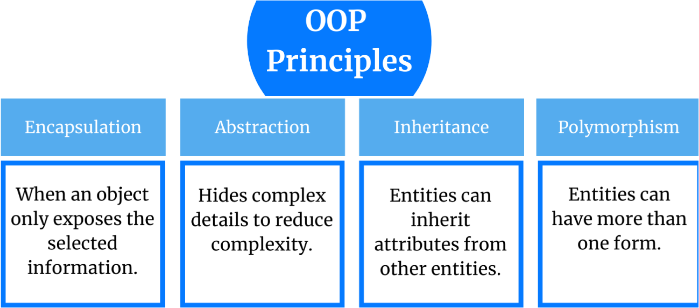

# typescript-solid-learning
Learn typescript SOLID principles &amp;&amp; 4 pillars of OOP

## Goal
Continuous reading and implementation of the understood concepts.

## What & How 
>TypeScript is JavaScript with syntax for types. TypeScript is a typed superset of JavaScript that compiles to plain JavaScript

TypeScript is a strongly typed programming language that builds onJavaScript, giving you better tooling at any scale.

***JavaScript and More :*** TypeScript adds additional syntax to JavaScript to support a tighter integration with your editor. Catch errors early in your editor.

***A Result You Can Trust :*** TypeScript code converts to JavaScript, which runs anywhere JavaScript runs: In a browser, on Node.js or Deno and in your apps.

***Safety at Scale :*** TypeScript understands JavaScript and uses type inference to give you great tooling without additional code.

[Typescript Lang](https://www.typescriptlang.org/docs/handbook/typescript-in-5-minutes.html)

### Install Typescript
TypeScript can be installed through three installation routes an npm module, a NuGet package or a Visual Studio Extension. 
Install using npm,

   >npm install -g typescript --save-dev
  
- -g : install globally

- --save-dev: It is important to include the --save-dev flag because it saves TypeScript as a development dependency. This means that TypeScript is absolutely required for the development of your project.

  [Typescript Installation](https://www.typescriptlang.org/download)
    >npx tsc --init
  
    It initialises the typescript project, run this command to project directory.

    ***npx*** allows us to run packages without having to install them globally. The tsc command is used here because it is the built-in TypeScript compiler.
  
    ***--init flag*** in the above command will initialize your project by creating a tsconfig.json file in your typescript-project project directory. This tsconfig.json file will allow you to configure further and customize how TypeScript and the tsc compiler interact.

### Install Parcel
Parcel is a web application bundler, differentiated by its developer experience
>npm install --save-dev parcel
### 4 Pillers of OOP

#### Abstraction
- It is  the concept of OOP that **shows** only essential information or attributes & **hides** unnecessary information.
>***Hiding unnecessary information from users.***
  - Ex: if you were creating a machine to make coffee for your users. There could be two approaches:
  ``` 
    How to Create it With Abstraction
        Have a button with the title "Make coffee"
    
    How to Create it Without Abstraction
        Have a button with the title "Boil the water"
        Have a button with the title "Add the cold water to the kettle"
        Have a button with the title "Add 1 spoon of ground coffee to a clean cup"
        Have a button with the title "Clean any dirty cups"
        And all the other buttons 
   ```
That means abstraction hides all the unnecessary steps and allows user by providing specific or necessary steps or information

#### Encapsulation
- The action of enclosing something in or as if in a capsule
- Encapsulation is also known as data hiding. 
- It hides implementation details of class from users. 
- It is the mechanism of restricting(private) direct access to components of an object. 
- It allows user to access only specific operations of an object.

#### Inheritance
- It is a mechanism where we can to derive a class from another class for a hierarchy of classes that share a set of attributes and methods.
- Suppose there is a class called 'Animal', and there is a child class 'Dog'. As Dog is a child of Animal class, Dog class shares some properties of Animal class and has his own specific or distinguishable properties. 
- Liskov Substitution Principle (LSP) : If S is subtype of T, then object of type Tin a program may be replaced with objects of type S without altering any of the desirable properties if that program.

#### Polymorphism
- Poly = many and Morph = change or form
- Inheritance is one possible way of implementing polymorphism.
- It describes situations in which something occurs in several different form.(function overloading)

### SOLID 
- **S** **:** Single Responsibility Principle (SRP)
“There should never be more than one reason for a class to change.”  
  [SRP Readme](https://github.com/SnehalChetan/typescript-solid-learning/tree/main/0.S)

- **O** **:** Open-Close Principle (OCP) Abstraction/Interface
“Software entities … should be open for extension, but closed for modification.”  
    [OCP Readme](https://github.com/SnehalChetan/typescript-solid-learning/tree/main/1.O) 

- **L** **:** Liskov Substitution Principle (LSP)
“Functions that use pointers or references to base classes must be able to use objects of derived classes without knowing it.”    
    [LSP Readme](https://github.com/SnehalChetan/typescript-solid-learning/tree/main/2.L)

- **I** **:** Interface Segregation Principle
“Many client-specific interfaces are better than one general-purpose interface.”
  [SRP Readme](https://github.com/SnehalChetan/typescript-solid-learning/tree/main/3.I)

- **D** **:** Dependency Inversion Principle (DIP)
“Depend upon abstractions, [not] concretions.”
  [DIP Readme](https://github.com/SnehalChetan/typescript-solid-learning/tree/main/4.D)


